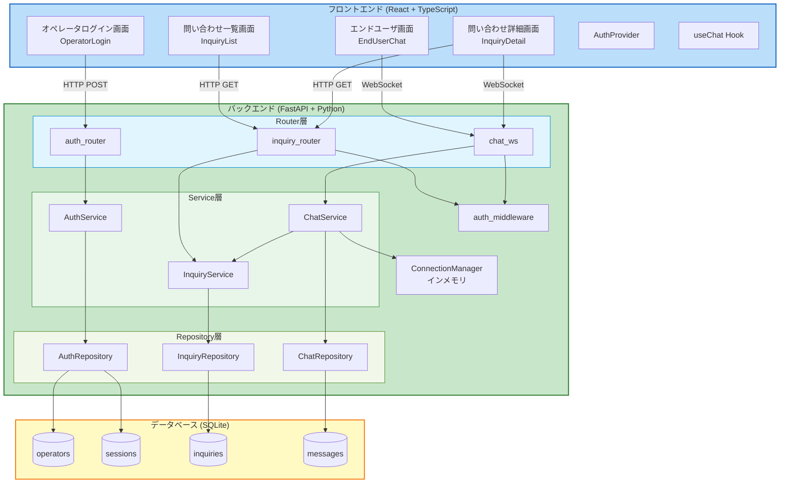
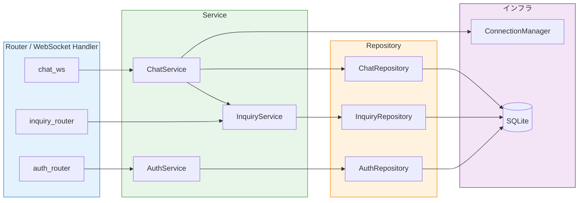
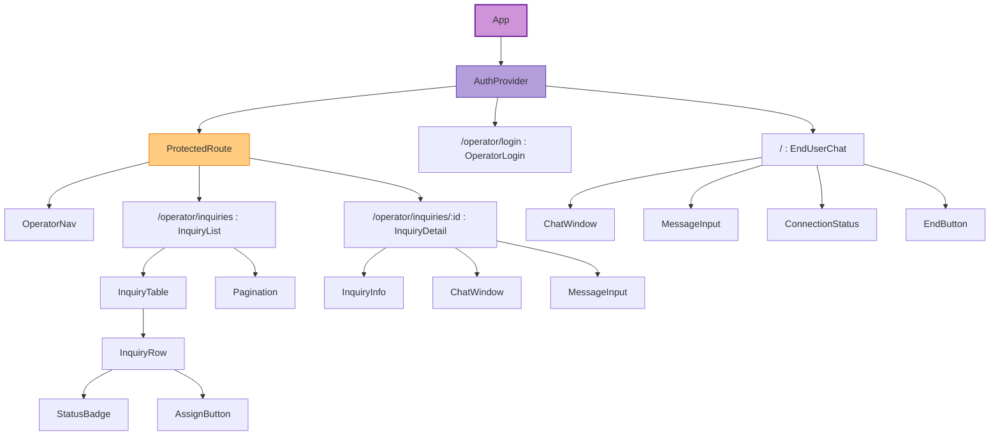

# アーキテクチャ図

## システム全体構成

```mermaid
graph TB
    subgraph Frontend["フロントエンド (React + TypeScript)"]
        EU[エンドユーザ画面<br/>EndUserChat]
        OL[オペレータログイン画面<br/>OperatorLogin]
        IL[問い合わせ一覧画面<br/>InquiryList]
        ID[問い合わせ詳細画面<br/>InquiryDetail]
        AP[AuthProvider]
        UC[useChat Hook]
    end

    subgraph Backend["バックエンド (FastAPI + Python)"]
        subgraph Routers["Router層"]
            AR[auth_router]
            IR[inquiry_router]
            CW[chat_ws]
        end
        subgraph Services["Service層"]
            AS[AuthService]
            IS[InquiryService]
            CS[ChatService]
        end
        subgraph Repositories["Repository層"]
            ARE[AuthRepository]
            IRE[InquiryRepository]
            CRE[ChatRepository]
        end
        CM[ConnectionManager<br/>インメモリ]
        MW[auth_middleware]
    end

    subgraph Database["データベース (SQLite)"]
        OT[(operators)]
        ST[(sessions)]
        IT[(inquiries)]
        MT[(messages)]
    end

    EU -->|WebSocket| CW
    ID -->|WebSocket| CW
    OL -->|HTTP POST| AR
    IL -->|HTTP GET| IR
    ID -->|HTTP GET| IR

    AR --> AS
    IR --> IS
    IR --> MW
    CW --> CS
    CW --> MW

    AS --> ARE
    IS --> IRE
    CS --> CRE
    CS --> CM
    CS --> IS

    ARE --> OT
    ARE --> ST
    IRE --> IT
    CRE --> MT

    style Frontend fill:#BBDEFB,stroke:#1565C0,stroke-width:2px
    style Backend fill:#C8E6C9,stroke:#2E7D32,stroke-width:2px
    style Database fill:#FFF9C4,stroke:#F57F17,stroke-width:2px
    style Routers fill:#E1F5FE,stroke:#0288D1,stroke-width:1px
    style Services fill:#E8F5E9,stroke:#388E3C,stroke-width:1px
    style Repositories fill:#F1F8E9,stroke:#558B2F,stroke-width:1px
```

## バックエンド レイヤー構成

```mermaid
graph LR
    subgraph Layer1["Router / WebSocket Handler"]
        R1[auth_router]
        R2[inquiry_router]
        R3[chat_ws]
    end

    subgraph Layer2["Service"]
        S1[AuthService]
        S2[InquiryService]
        S3[ChatService]
    end

    subgraph Layer3["Repository"]
        D1[AuthRepository]
        D2[InquiryRepository]
        D3[ChatRepository]
    end

    subgraph Infra["インフラ"]
        CM[ConnectionManager]
        DB[(SQLite)]
    end

    R1 --> S1
    R2 --> S2
    R3 --> S3

    S1 --> D1
    S2 --> D2
    S3 --> D3
    S3 --> CM
    S3 --> S2

    D1 --> DB
    D2 --> DB
    D3 --> DB

    style Layer1 fill:#E3F2FD,stroke:#1976D2,stroke-width:1px
    style Layer2 fill:#E8F5E9,stroke:#388E3C,stroke-width:1px
    style Layer3 fill:#FFF3E0,stroke:#F57C00,stroke-width:1px
    style Infra fill:#F3E5F5,stroke:#7B1FA2,stroke-width:1px
```

## フロントエンド コンポーネント構成

```mermaid
graph TB
    App[App]
    App --> AuthProv[AuthProvider]

    AuthProv --> Route1["/ : EndUserChat"]
    AuthProv --> Route2["/operator/login : OperatorLogin"]
    AuthProv --> Protected[ProtectedRoute]

    Protected --> Nav[OperatorNav]
    Protected --> Route3["/operator/inquiries : InquiryList"]
    Protected --> Route4["/operator/inquiries/:id : InquiryDetail"]

    Route1 --> CW1[ChatWindow]
    Route1 --> MI1[MessageInput]
    Route1 --> CS1[ConnectionStatus]
    Route1 --> EB[EndButton]

    Route3 --> IT[InquiryTable]
    Route3 --> PG[Pagination]
    IT --> IR[InquiryRow]
    IR --> SB[StatusBadge]
    IR --> AB[AssignButton]

    Route4 --> II[InquiryInfo]
    Route4 --> CW2[ChatWindow]
    Route4 --> MI2[MessageInput]

    style App fill:#CE93D8,stroke:#6A1B9A,stroke-width:2px
    style AuthProv fill:#B39DDB,stroke:#4527A0,stroke-width:1px
    style Protected fill:#FFCC80,stroke:#EF6C00,stroke-width:1px
```
