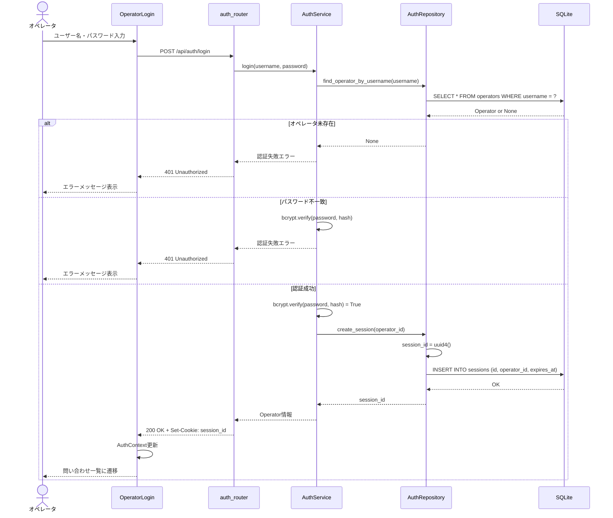
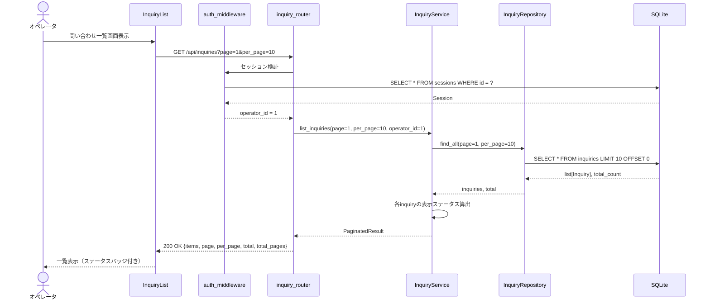
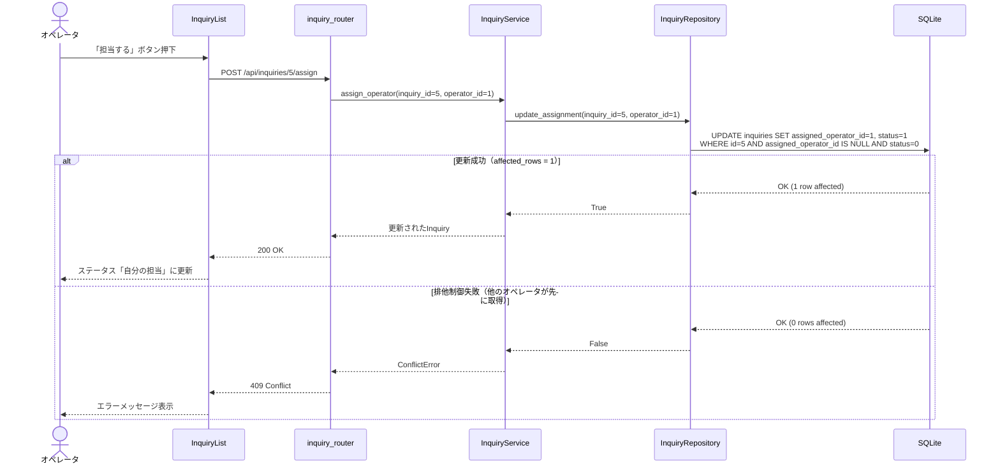
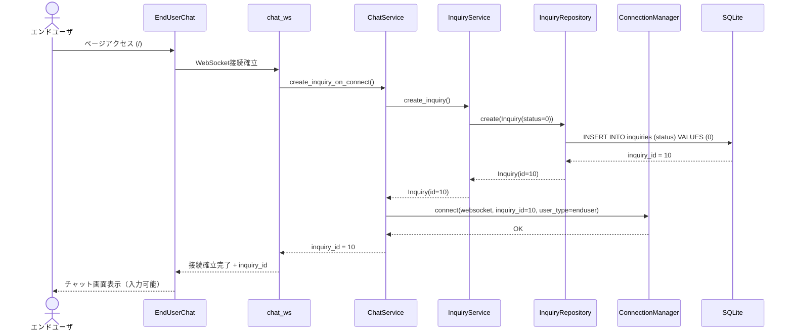
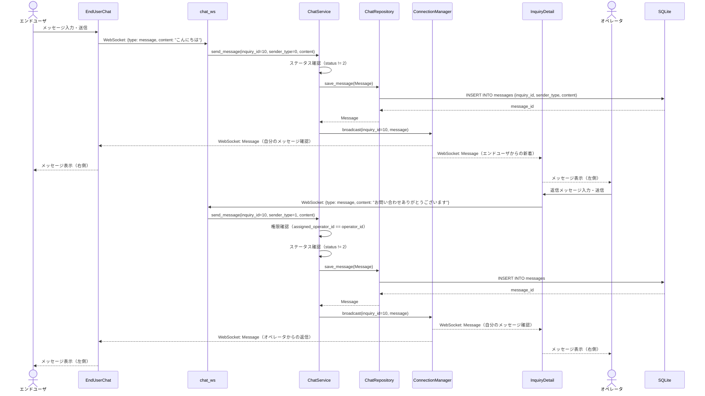
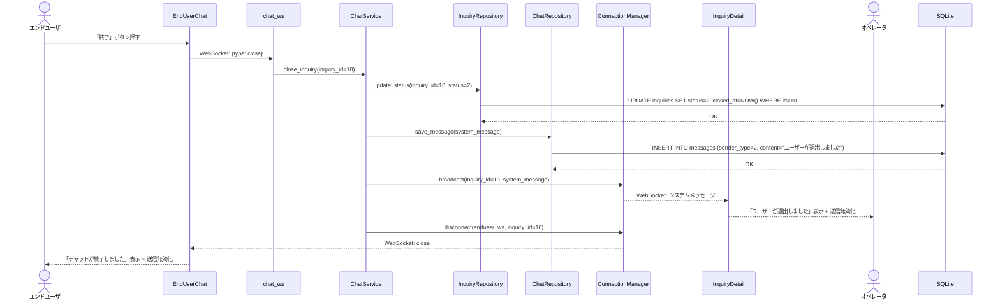
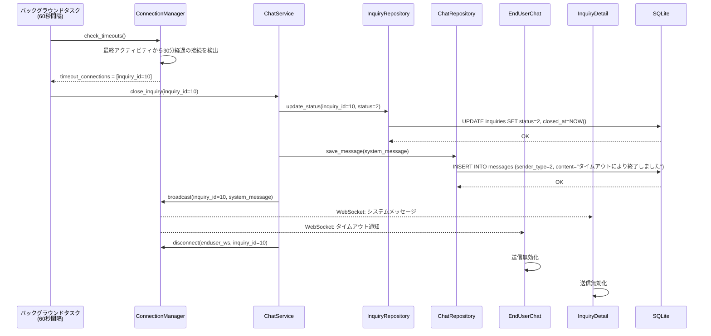
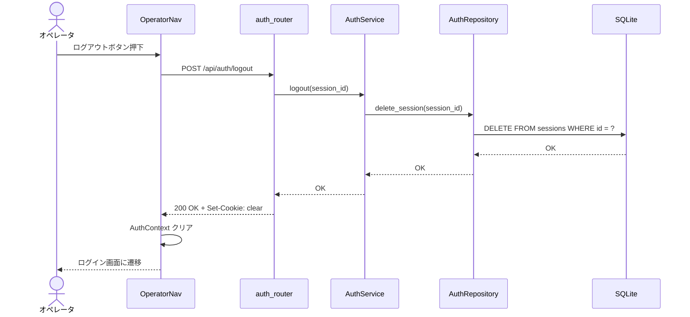
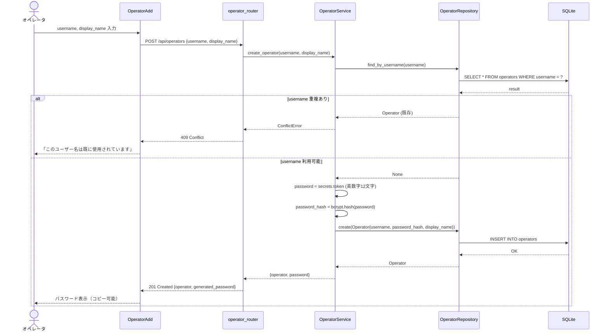
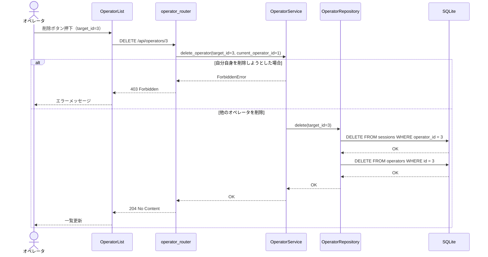

# シーケンス図

## 1. オペレータログイン

## 2. 問い合わせ一覧取得（ページング付き）

## 3. 問い合わせ担当取得（排他制御）

## 4. エンドユーザ チャット開始

## 5. メッセージ送受信

## 6. セッション終了（明示的な終了ボタン）

## 7. セッションタイムアウト

## 8. オペレータ ログアウト

## 9. オペレータ追加

## 10. オペレータ削除

