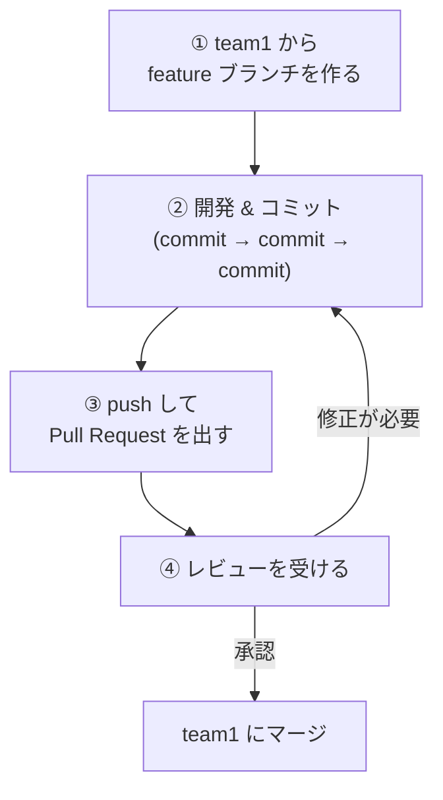
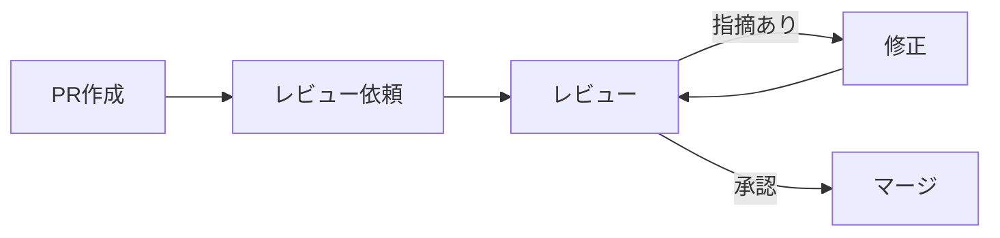

# Git フローガイド

このドキュメントでは、チーム開発で使用する Git のブランチ戦略と作業フローを説明します。

## ブランチ構成

```
main
 │
 ├── team1          ← チーム1のベースブランチ
 │    ├── team1/feature/login-form
 │    ├── team1/feature/chat-ui
 │    └── team1/feature/api-integration
 │
 ├── team2          ← チーム2のベースブランチ
 │    ├── team2/feature/operator-dashboard
 │    └── team2/feature/user-management
 │
 └── team3          ← チーム3のベースブランチ
      └── team3/feature/websocket-handler
```

## 全体の流れ



## 手順の詳細

### 1. feature ブランチを作成する

ベースブランチ（例: `team1`）から新しい feature ブランチを作ります。

```bash
# ベースブランチを最新にする
git checkout team1
git pull origin team1

# feature ブランチを作成して切り替える
git checkout -b team1/feature/login-form
```

#### ブランチ命名規則

```
{チーム名}/feature/{機能名}
```

| 例 | 説明 |
|----|------|
| `team1/feature/login-form` | ログインフォームの実装 |
| `team1/feature/chat-ui` | チャットUIの実装 |
| `team2/feature/fix-typo` | タイプミスの修正 |

機能名は **短く・わかりやすく・英語（ケバブケース）** で付けましょう。

### 2. 開発してコミットする

```bash
# 変更をステージに追加
git add ファイル名

# コミット（何をしたか簡潔に書く）
git commit -m "feat: ログインフォームのUIを実装"
```

#### コミットメッセージの書き方

```
<種類>: <何をしたか>
```

| 種類 | 用途 | 例 |
|------|------|-----|
| `feat` | 新機能の追加 | `feat: チャット送信ボタンを追加` |
| `fix` | バグの修正 | `fix: メッセージが表示されないバグを修正` |
| `docs` | ドキュメントの変更 | `docs: READMEにセットアップ手順を追加` |
| `style` | コードの見た目の修正（動作に影響なし） | `style: インデントを修正` |
| `refactor` | リファクタリング | `refactor: API呼び出しを共通化` |

#### コミットのコツ

- **こまめにコミット**する（1つの変更 = 1コミットが理想）
- 「動く状態」でコミットする
- 大きな変更を一度にコミットしない

### 3. リモートに push して PR を出す

```bash
# リモートに push
git push origin team1/feature/login-form
```

push したら **GitHub 上で Pull Request（PR）** を作成します。

#### PR の作成手順

1. GitHub のリポジトリページを開く
2. 「Compare & pull request」ボタンをクリック
3. 以下を設定：
   - **base**: `team1`（マージ先 = ベースブランチ）
   - **compare**: `team1/feature/login-form`（自分のブランチ）
4. タイトルと説明を記入
5. 「Create pull request」をクリック

#### PR の書き方テンプレート

```markdown
## 概要
ログインフォームのUIを実装しました。

## 変更内容
- ログインページのコンポーネントを作成
- バリデーション（入力チェック）を追加
- ログインAPIとの接続

## 動作確認
- [ ] ログインできることを確認
- [ ] 空入力でエラーが表示されることを確認
- [ ] パスワード間違いでエラーが表示されることを確認
```

### 4. レビューを受けてマージする



- チームメンバーや メンターにレビューを依頼する
- 指摘があればコードを修正して再度 push する
- 承認（Approve）をもらえたら **マージ** する

## よく使う Git コマンド一覧

| コマンド | 説明 |
|---------|------|
| `git status` | 現在の状態を確認 |
| `git branch` | ブランチ一覧を表示 |
| `git checkout ブランチ名` | ブランチを切り替える |
| `git checkout -b ブランチ名` | 新しいブランチを作って切り替える |
| `git add ファイル名` | 変更をステージに追加 |
| `git add .` | 全変更をステージに追加 |
| `git commit -m "メッセージ"` | コミットする |
| `git push origin ブランチ名` | リモートに push |
| `git pull origin ブランチ名` | リモートの最新を取得してマージ |
| `git log --oneline` | コミット履歴を1行ずつ表示 |
| `git diff` | 変更差分を確認 |

## コンフリクト（競合）が起きたら

複数人が同じファイルの同じ箇所を編集すると、コンフリクトが発生します。

### コンフリクトの解消手順

```bash
# 1. ベースブランチの最新を取り込む
git checkout team1
git pull origin team1
git checkout team1/feature/login-form
git merge team1
```

コンフリクトが発生すると、ファイル内に以下のような表示が出ます：

```
<<<<<<< HEAD
自分の変更
=======
相手の変更
>>>>>>> team1
```

### 解消方法

1. 該当ファイルを開く
2. `<<<<<<<`、`=======`、`>>>>>>>` の行を削除する
3. 残したい内容に書き換える（両方残す場合もある）
4. 保存してコミットする

```bash
git add .
git commit -m "fix: team1ブランチとのコンフリクトを解消"
git push origin team1/feature/login-form
```

> **困ったらメンターに相談しましょう！** コンフリクト解消は慣れるまで難しいので、無理に一人で解決しようとしなくて大丈夫です。

## やってはいけないこと

| NG | 理由 |
|----|------|
| `main` ブランチに直接 push する | 全チームに影響が出る |
| 他チームのブランチを勝手に変更する | 混乱の原因になる |
| `git push --force` を使う | 他の人の変更が消える可能性がある |
| 大量の変更を1コミットにまとめる | レビューしづらく、問題が起きた時に戻しづらい |
| コミットメッセージを適当に書く | 後から何をしたかわからなくなる |

## 困ったときは

| 状況 | 対応 |
|------|------|
| 間違えてコミットした | `git reset --soft HEAD~1` で直前のコミットを取り消し |
| 変更を一時的に退避したい | `git stash` → 後で `git stash pop` で戻す |
| 今どのブランチにいるかわからない | `git branch` で確認（`*` が付いているのが現在のブランチ） |
| push したら怒られた | エラーメッセージを読む → 大体は `git pull` してから再 push |
| なにもかもわからない | メンターに聞く！遠慮せずに聞いてOK |
